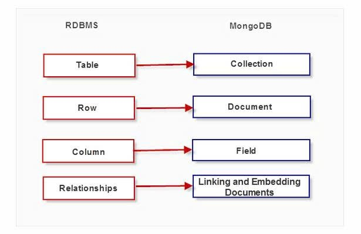

MONGODB

SOME DIFFERENCES ABOUT RDBMS (SQL) VS MONGODB (NOSQL)

DAY 1

\_ CRUD Collection
\_ Insert one and many data
\_ Delete document, add one new document for all data
\_ Update one and many data

DAY 2
\_ $expr (expression)
\_ $eq (equal)
\_ gt (greater), lt (less), gte (greater or equal), lte (less or equal)
