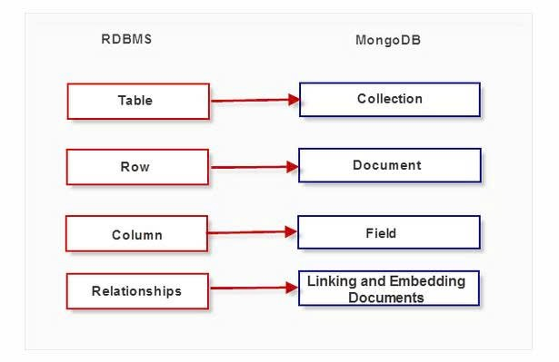

# MongoDB and NestJS Learning Repository - C2409G1 (Semester 3)

Welcome to the learning repository for Semester 3 of the Aptech C2409G1 class. This repository contains all the coursework, exercises, and projects focused on mastering **MongoDB** and **NestJS**.

## Overview of Technologies

### MongoDB vs RDBMS (SQL)
There are several key differences between relational databases (SQL) and NoSQL databases like MongoDB:



## Repository Structure & Progress

This repository is organized by learning days and progressive projects:

### 🗄️ MongoDB Fundamentals (Day 1 - Day 4)
The initial phase focuses on MongoDB operations via `.mongodb.js` playground scripts.

*   **Day 1 & 2 (`Day1`, `Day2`): Basic CRUD & Operators**
    *   Basic Collection CRUD (Create, Read, Update, Delete).
    *   Inserting single and multiple documents.
    *   Updating data conditionally.
    *   Query operators: `$expr`, `$eq`, `$gt`, `$lt`, `$gte`, `$lte`.
*   **Day 3 & 4 (`Day3`, `Day4`): Advanced Queries & Aggregations**
    *   Sorting and pagination (`sort`, `limit`, `skip`).
    *   Projections (selecting specific fields).
    *   Aggregation pipelines (`$lookup` for joining collections like `category`, `product`, `invoice_details`).
    *   Unwinding arrays and matching data within aggregations (`$unwind`, `$match`).
    *   Complex queries: e.g., filtering invoices by total amount or calculating totals over a specific year.

### 🚀 NestJS Backend Projects (Day 5 onwards)
Transitioning into backend development with the NestJS framework connected to MongoDB.

*   **`Day5and6and7`**: Introduction to NestJS. Basic project setup, controllers, services, and modules integration.
*   **`nest-mongodb`**: A more comprehensive NestJS project implementing MongoDB integration using Mongoose, expanding on typical CRUD API structures (handling products, categories, etc.).
*   **`nest-mongodb-test`**: The active testing/exam project. It includes advanced implementations such as transaction management (`transaction.controller.ts`), account management, authentication, and structured modular architecture.

## How to Run the NestJS Projects

1. Navigate to the desired project directory (e.g., `cd nest-mongodb-test`).
2. Install dependencies:
   ```bash
   npm install
   ```
3. Ensure you have your `.env` configured appropriately.
4. Run the development server:
   ```bash
   npm run start:dev
   ```

## Author
*   **Class:** C2409G1 (Semester 3)
*   **Focus:** Backend Development (NestJS & MongoDB)
